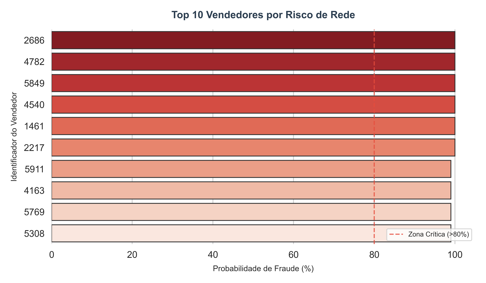

# 🛡️ Modernização de Regras Antifraude: De SAS para dbt & SQL

Este projeto demonstra a migração e implementação de um motor de regras de antifraude, traduzindo lógicas de sistemas legados para uma infraestrutura moderna de dados (**Modern Data Stack**).

## 🚀 Contexto e Valor de Negócio
No mercado segurador e de e-commerce, a eficiência na detecção de fraude depende da agilidade e escalabilidade das regras. Este projeto foca na transposição de inteligência investigativa para um ambiente de alta performance, permitindo o processamento de grandes volumes de dados com total rastreabilidade.

## 🛠️ Stack Técnica
- **Transformação de Dados:** dbt (Data Build Tool).
- **Armazenamento e Processamento:** DuckDB (simulando ambientes como Snowflake/BigQuery).
- **Linguagem:** SQL (Core das regras de negócio).
- **Inteligência de Apoio:** Python (Cálculo de Score e Visualização).

## 🧠 Arquitetura da Solução e Migração
O projeto foi estruturado seguindo o padrão de camadas (Medallion Architecture):
1. **Bronze (Raw):** Ingestão de dados brutos de cadastros e registros de dispositivos.
2. **Silver (Intermediate):** Tradução das regras de negócio antes executadas em ambientes SAS para queries SQL otimizadas no dbt. Implementação de lógicas de cruzamento de `device_id` e `ip_origem` para identificar comportamentos suspeitos.
3. **Gold (Analytics):** Consolidação dos alertas e geração de **Score de Risco** para apoio à tomada de decisão estratégica.

## 📊 Visualização de Resultados
O gráfico abaixo apresenta o output final do motor de regras. Através da tradução das lógicas de vínculo, foi possível identificar os 10 casos de maior criticidade, todos posicionados na **Zona Crítica de Risco (>80%)**.

## 📁 Organização do Projeto
- `/data`: Repositório dos arquivos de dados e alertas finais.
- `/dbt_mercado_livre`: Modelos de transformação e documentação das regras.
- `run_prediction.py`: Script de cálculo de probabilidade e score.
- `visualizar_resultados.py`: Script Python para geração de visualizações técnicas de alto impacto.